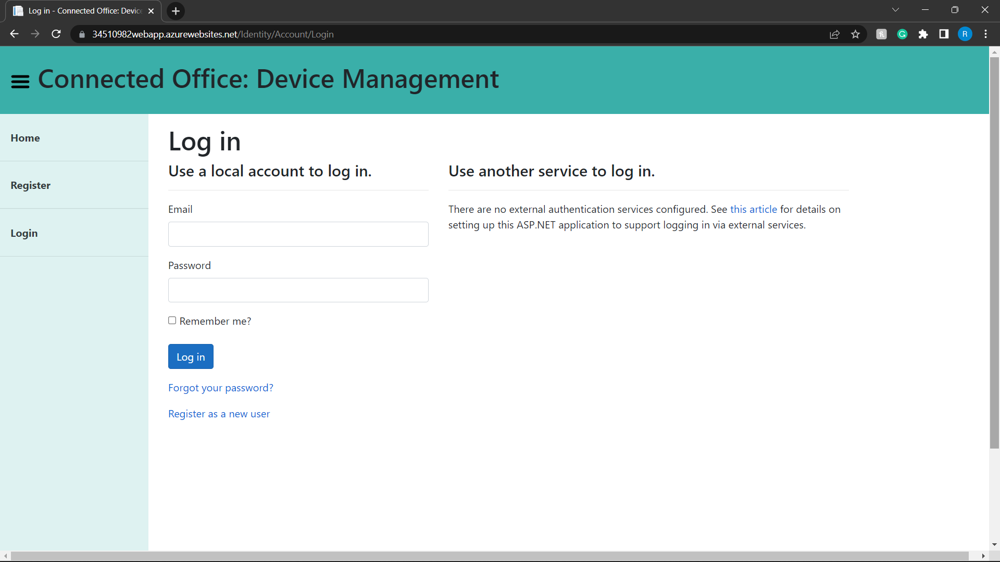
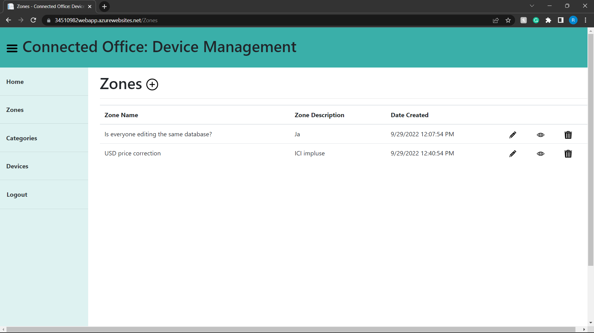
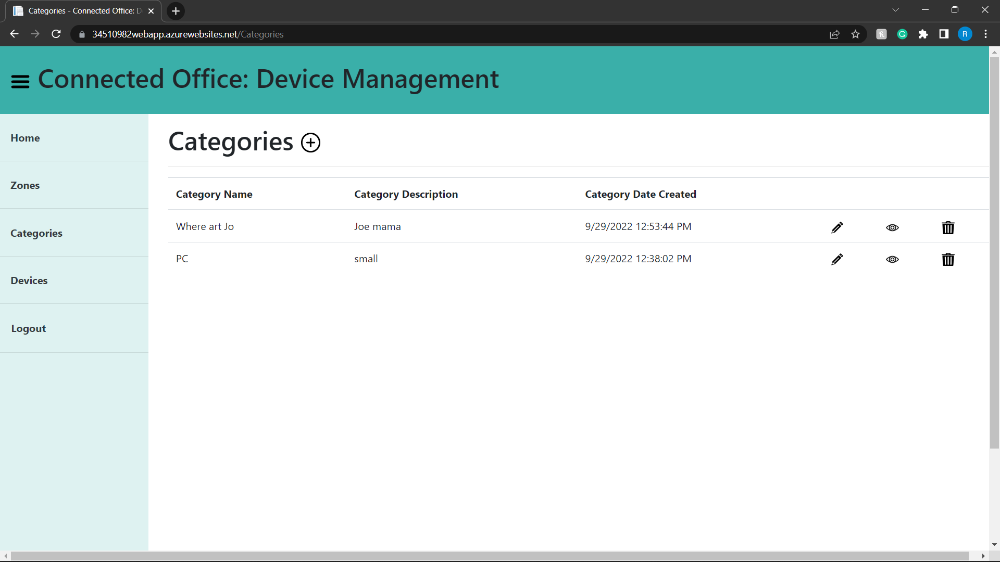
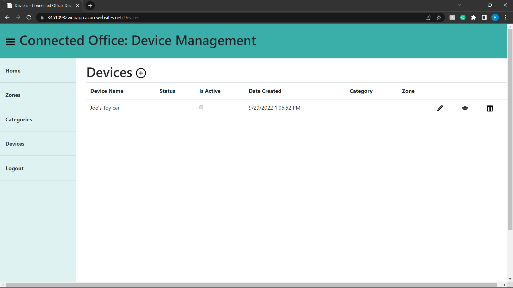

## CMPG323-Project-2---34510982

### Repositories created & used
---
Each project will have its own repository, as specified in the brief.
- Project 1:    CMPG323-Overview---34510982
- Project 2:    CMPG323-Project-2---34510982
# - Project 3:    CMPG323-Project-3---34510982
- Project 4:    CMPG323-Project-4---34510982
- Project 5:    CMPG323-Project-5---34510982
- PoE: CMPG323-PoE---34510982

### Link
https://34510982webapp.azurewebsites.net/

### Branching
---
A develop branch was used on early stages of development. It was however easier to only use the main branch since I only commited if the code had no errors. I was also the only one using the repo.

### gitignore file
---
Added the appsettings.json file to .gitignore to hide the credentials in my connection string.

### Screenshots
---
# Login

---
# Zones

---
# Categories

---
# Devices
